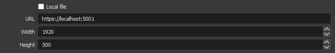
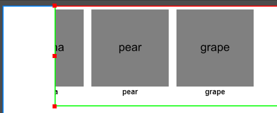

# Nullforce.StreamTools.ImageScroller

A Blazor WebAssembly app that scrolls images from a local directory. Can be used as a browser source in OBS.

<!-- |||
----------------------|---
**Build**             |  -->

## How to Use

1. Download the release for your operating system from [GitHub releases](https://github.com/nullforce-public/Nullforce.StreamTools.ImageScroller/releases/).
For example: `Nullforce.StreamTools.ImageScroller-0.2.0-win-x64.zip`

2. Extract the contents into a folder on your computer.

3. (optionally) Modify the `appsettings.json` file as described in the
Configuration section below.

4. Put your image files into the `C:\images` folder (or the folder set in
`ImageLocation` in the `appsettings.json`).

5. Run the executable. For example `Nullforce.StreamTools.ImageScroller.exe`.

6. In OBS (or your capture application), add a browser source to your scene with
the URL as `https://localhost:5001` (or as it is set in `appsettings.json`).

    

7. (optionally) To have images scroll into and out of view, instead of appearing
on the left and disappearing on the right, apply a crop in OBS to the bounding
box of the browser source. Hold ALT and drag the handles of the box in OBS so
that the first and last image aren't visible anymore.

    

## Configuration

Parameters can be configured unders ScrollSettings in the `appsettings.json` file.

### ScrollSettings

- **FontColor:** Either the CSS name of a color or a hexadecimal RGB code (e.g., #FF00FF).
Sets the color of the font displayed below the image.
- **ImageCount:** The number of images shown at the same time.
- **ImageLocation:** The folder containing the images to be shown.
- **ImageMaxHeight:** The maximum image height in pixels. If the image height is
above this, it will be scaled down to match.
- **ImageMaxWidth:** The maximum image width in pixels. If the image width is
above this, it will be scaled down to match.
- **IntervalInSeconds:** The amount of time between each scroll action.
- **ShowFilename:** true or false. Whether to show the filename below the image.
- **ShuffleImages:** true or false. Whether the images should be shuffled randomly
on start; otherwise, they will be shown in order.

## Developer Usage

### Launch the Web App via dotnet

From the project root directory:

`dotnet run --project src/Nullforce.StreamTools.ImageScroller`

## Building / Contributing

TBD
